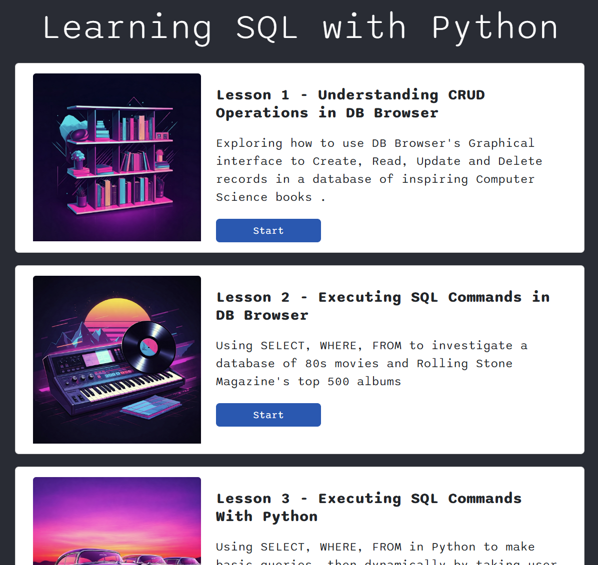

# Welcome to the SQLite Course

## Learning SQL with Python

This is a series of lessons aimed at A-Level Computer students.

## How to Use This Repository

1. Clone the repository to your local machine, or download as a ZIP file.
2. Navigate to the `Lesson Resources` folder to find the lesson-specific resources and scripts.
3. Follow along with the `Student Guide` for detailed instructions and explanations for each lesson.

I currently have a live version of the student guide here, though this may be relocated in the future.

I currently have a live version of the student guide [here](https://gwa-cs.web.app/databases/), though this may be relocated in the future.

## Prerequisites

- Basic understanding of Python programming.
- SQLite installed on your machine.
- DB Browser for SQLite

## Lessons Overview

### Lesson 1 - Understanding CRUD Operations in DB Browser

Explore how to use DB Browser's graphical interface to Create, Read, Update, and Delete records in a database of inspiring Computer Science books.

### Lesson 2 - Executing SQL Commands in DB Browser

Use SELECT, WHERE, FROM to investigate a database of 80s movies and Rolling Stone Magazine's top 500 albums.

### Lesson 3 - Executing SQL Commands With Python

Learn to use SELECT, WHERE, FROM in Python to make basic queries, then dynamically by taking user input to find the perfect American car.

### Lesson 4 - ORDER BY, ASC/DESC and LIMIT

Explore a dataset of world populations produced by the World Bank, and learn how to sort and limit your query results using the ORDER BY and LIMIT clauses.

### Lesson 5 - UPDATE and DELETE

Make revisions to the Periodic table as it was in 1900 by using the UPDATE and DELETE keywords.

### Lesson 6 - INSERT INTO

Use SQL to create database tables and keep records of student test scores by using the INSERT INTO keywords.

### Lesson 7 - Aggregate Functions

Use functions like SUM, AVG, COUNT, MAX, and MIN to analyze data from a database of mobile phone usage.

### Other lessons to follow

## Contributing

If you find any issues or have suggestions for improvements, feel free to open an issue or submit a pull request.

## License

This project is licensed under the MIT License.
